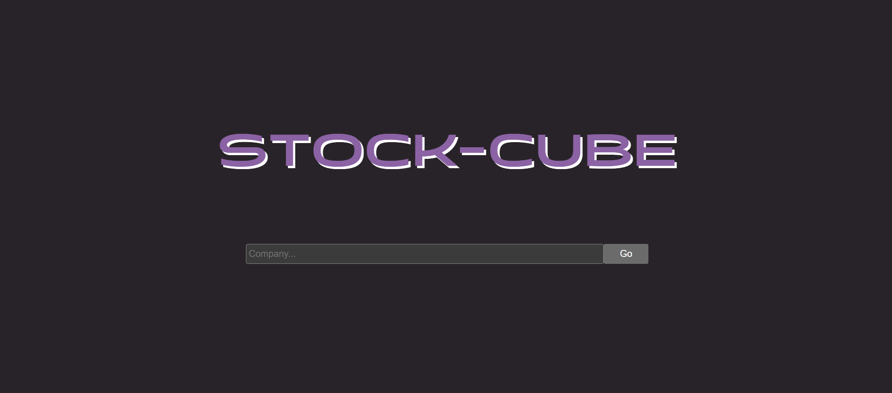
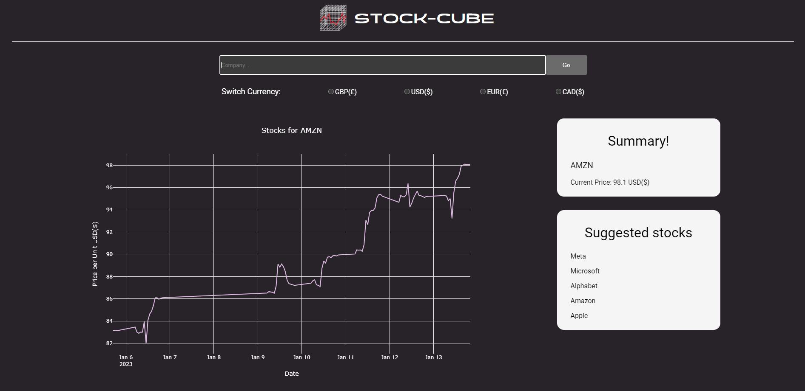

# Stocks Tracker App

<h1><a href="stock-cube.vercel.app">Visit Website</a></h1>

## Table of Contents
- [About](#about)
- [Screenshots](#screenshots)
- [Languages](#languages)
- [Code of Note](#code_of_note)
- [Bugs to fix](#bugs_to_fix)

---

## About 

A simple app designed to display the latest data about stocks. The user can type in a stock name such as GOOG or AMZN and a plotly graph will display the latest trends. The user can also switch between currencies. For this I linked the stocks data pulled from Alpha Vantage to an accurate currency conversion API to make sure it stayed up to date. This was my first TypeScript project.

---

## Screenshots 

---

## Languages 

- NextJS (using TypeScript)
- SCSS

---

## Code of Note 

- Plotly.js graph to display the stocks data which I pulled from a heavily nested JSON object, which is also fully styled.
- My first use of TypeScript.
- Linking a currency API to the stocks API for accurate stocks prices.
- Designed a pretty cool logo

---

## Bugs to fix 

- I want to implement an API which can let the user type in a company name rather than the trading name (Microsoft instead of MSFT) to make it more beginner friendly as the API I'm using for the stocks data only provides the trading name.